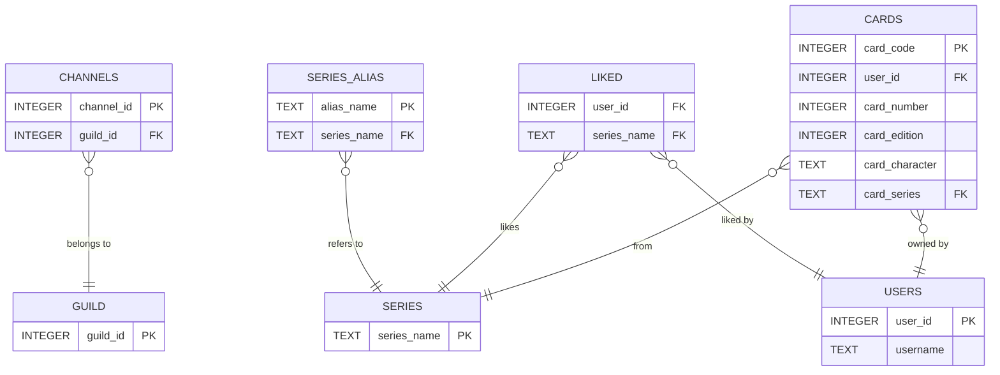

# Database's Diagram (Mermaid)

Channels table stores the channels where the bot is active, linked to their respective guilds. Each guild can have multiple channels.  
Series table contains the names of different series. Each series can have multiple aliases stored in the Series_Alias table.  
Users table holds information about users, including their unique IDs and usernames.  
Liked table tracks which users have liked which series. Each entry is linked to a user and a series.  
Cards table contains information about cards owned by users, including their attributes and the series they belong to.